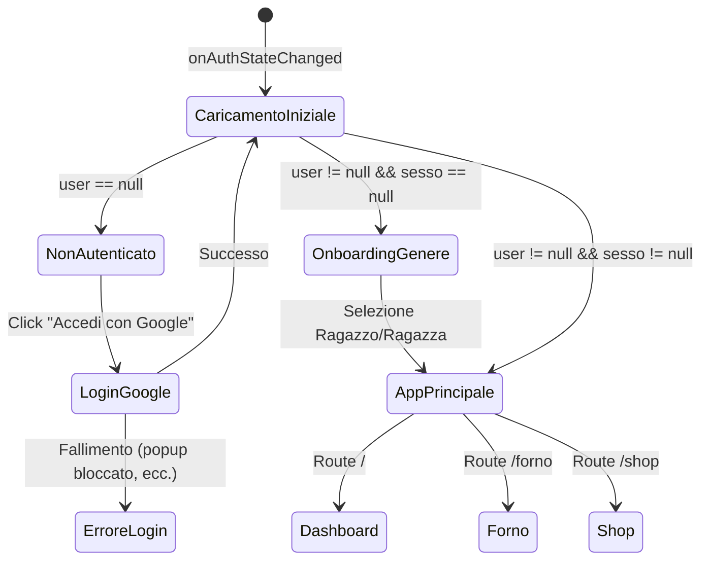
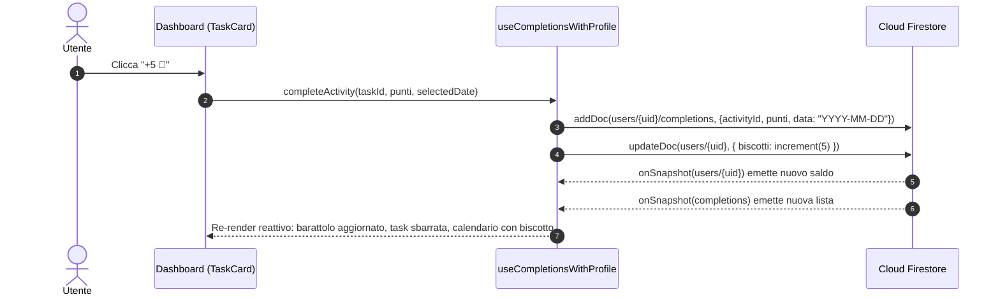
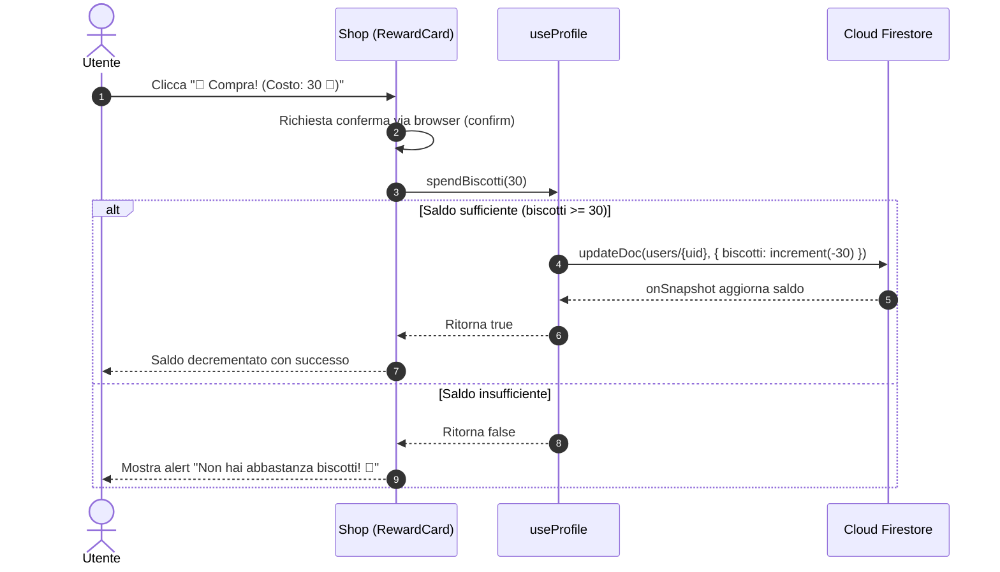

# 🍪 Cookie Tracker — Documentazione Tecnica del Codice

> **Guida completa all'architettura, al modello dati e al funzionamento interno dell'applicazione per sviluppatori.**

---

## 📑 Indice

1. [Panoramica del Progetto](#1-panoramica-del-progetto)
2. [Stack Tecnologico](#2-stack-tecnologico)
3. [Architettura del Sistema](#3-architettura-del-sistema)
4. [Modello Dati Firestore (Database Schema)](#4-modello-dati-firestore-database-schema)
5. [Autenticazione e Ciclo di Vita dell'App](#5-autenticazione-e-ciclo-di-vita-dellapp)
6. [Analisi Dettagliata dei Custom Hooks](#6-analisi-dettagliata-dei-custom-hooks)
7. [Analisi dei Componenti e delle Pagine](#7-analisi-dei-componenti-e-delle-pagine)
8. [Gestione delle Date (`dateUtils.js`)](#8-gestione-delle-date-dateutilsjs)
9. [Flussi Dati Chiave (Diagrammi Mermaid)](#9-flussi-dati-chiave-diagrammi-mermaid)
10. [Regole di Sicurezza Firestore](#10-regole-di-sicurezza-firestore)
11. [Build, Configurazione e Deployment](#11-build-configurazione-e-deployment)
12. [Debito Tecnico e Potenziali Migliorie Future](#12-debito-tecnico-e-potenziali-migliorie-future)

---

## 1. Panoramica del Progetto

**Cookie Tracker** è un'applicazione web gamificata per il monitoraggio delle abitudini e delle attività quotidiane, progettata con un'estetica calorosa a tema "pasticceria" (*bakery cozy theme*).

### Concetto Fondamentale
L'utente completa compiti e abitudini ricorrenti (*giornaliere* o *settimanali*), guadagnando come ricompensa dei **Biscotti 🍪** virtuali. Questi biscotti confluiscono in un "barattolo" (*cookie jar*) e possono essere:
1. **Spesi nello Shop**: per acquistare ricompense reali stabilite dall'utente (es. *1 ora di videogiochi*, *serata pizza*, *acquisto di un libro*).
2. **Accumulati per i Traguardi Mensili**: obiettivi a soglia calcolati sulla somma dei biscotti guadagnati nel mese corrente, che si sbloccano automaticamente senza dover spendere il proprio saldo.

L'interfaccia è orientata al **mobile-first**, con larghezza massima compatta (`max-w-md`), barra di navigazione inferiore persistente (*bottom navbar*) con effetto *glassmorphism* e feedback tattile/visivo immediato.

---

## 2. Stack Tecnologico

| Tecnologia | Versione | Ruolo nell'architettura |
| :--- | :--- | :--- |
| **React** | `19.2.x` | Libreria UI con approccio dichiarativo a componenti funzionali e hooks |
| **Vite** | `8.3.x` | Bundler e build tool ultra-rapido con supporto Hot Module Replacement (HMR) |
| **Tailwind CSS** | `4.3.x` | Framework utility-first tramite il nuovo pacchetto `@tailwindcss/vite` |
| **Firebase SDK** | `12.19.x` | Backend-as-a-Service: Auth (Google Sign-In) e Cloud Firestore (database NoSQL in tempo reale) |
| **React Router** | `7.18.x` | Routing client-side per Single Page Application (SPA) |
| **Oxlint** | `1.81.x` | Linter ad altissime prestazioni per JavaScript/React |

---

## 3. Architettura del Sistema

L'applicazione segue un'architettura **Client-Side SPA reattiva** basata su pattern **Container/Presenter** e **Custom Hooks come Data Access Layer**:

```
                       ┌───────────────────────────────┐
                       │        Google Firebase        │
                       │   (Auth + Cloud Firestore)    │
                       └───────────────┬───────────────┘
                                       │ Real-time Sync (onSnapshot)
                                       ▼
                       ┌───────────────────────────────┐
                       │          AuthContext          │
                       │  (Stato globale utente loggato)│
                       └───────────────┬───────────────┘
                                       │ userId (UID)
                                       ▼
                       ┌───────────────────────────────┐
                       │         Custom Hooks          │
                       │ ├─ useProfile                 │
                       │ ├─ useActivities              │
                       │ ├─ useCompletions             │
                       │ ├─ useRewards                 │
                       │ └─ useMilestones              │
                       └───────────────┬───────────────┘
                                       │ Dati reattivi & metodi di mutazione
                                       ▼
  ┌────────────────────────────────────┼────────────────────────────────────┐
  │                                    │                                    │
  ▼                                    ▼                                    ▼
┌──────────────┐             ┌───────────────────┐               ┌────────────────────┐
│   Vetrina    │             │     Il Forno      │               │     Il Negozio     │
│ (Dashboard)  │             │ (Gestione Task)   │               │   (Shop & Premi)   │
└──────────────┘             └───────────────────┘               └────────────────────┘
```

### Struttura Directory del Progetto
```
cookie-tracker/
├── index.html                   # HTML template principale per Vite
├── package.json                 # Dipendenze e script npm
├── vite.config.js               # Configurazione plugin Vite e Tailwind
├── firebase.json                # Configurazione Firebase Hosting e rewrite SPA
├── firestore.rules              # Regole di sicurezza per Firestore
├── .env.example                 # Template variabili d'ambiente
├── .env.local                   # Credenziali Firebase (privato, ignorato da Git)
├── public/                      # Asset statici (favicon, icone SVG)
└── src/
    ├── main.jsx                 # Entry point dell'applicazione React
    ├── App.jsx                  # State machine di accesso & Router principale
    ├── App.css / index.css      # Regole globali e import Tailwind
    ├── firebase.js              # Inizializzazione SDK Firebase Auth e Firestore
    ├── contexts/
    │   └── AuthContext.jsx      # Provider per autenticazione Google
    ├── hooks/
    │   ├── useProfile.js        # Saldo biscotti e profilo utente
    │   ├── useActivities.js     # CRUD attività giornaliere/settimanali
    │   ├── useCompletions.js    # Log completamenti e calcolo totali mensili
    │   ├── useRewards.js        # CRUD catalogo premi acquistabili
    │   └── useMilestones.js     # CRUD traguardi mensili a soglia
    ├── pages/
    │   ├── Dashboard.jsx        # Schermata principale (Vetrina + Calendario + Task)
    │   ├── Forno.jsx            # Creazione e modifica delle attività
    │   └── Shop.jsx             # Acquisto premi e progresso traguardi
    ├── components/
    │   ├── Navbar.jsx           # Barra di navigazione mobile inferiore
    │   ├── Calendar.jsx         # Griglia calendario mensile personalizzata
    │   ├── TaskCard.jsx         # Scheda attività con spunta completata
    │   ├── RewardCard.jsx       # Scheda premio con verifica saldo
    │   ├── LoginScreen.jsx      # Schermata di login con Google
    │   ├── GenderPicker.jsx     # Selezione genere per pronomi (onboarding)
    │   ├── ActivityForm.jsx     # Modale creazione/modifica attività
    │   ├── RewardForm.jsx       # Modale creazione/modifica premio
    │   └── MilestoneForm.jsx    # Modale creazione/modifica traguardo
    └── utils/
        └── dateUtils.js         # Funzioni helper per formattazione date locali
```

---

## 4. Modello Dati Firestore (Database Schema)

Tutti i dati dell'applicazione sono strettamente incapsulati per utente, sfruttando il paradigma **Document -> Subcollections**:

```
users/ (collection)
  └── {userId}/ (document)
        ├── biscotti: number
        ├── sesso: "M" | "F" | null
        ├── createdAt: ISO string
        │
        ├── activities/ (subcollection)
        │     └── {activityId}/
        │           ├── nome: string
        │           ├── punti: number
        │           ├── tipo: "giornaliera" | "settimanale"
        │           ├── giorni: string[]  // es. ["lun", "mer", "ven"]
        │           └── createdAt: ISO string
        │
        ├── completions/ (subcollection)
        │     └── {completionId}/
        │           ├── activityId: string
        │           ├── punti: number
        │           ├── data: string      // formato "YYYY-MM-DD"
        │           └── completedAt: ISO string
        │
        ├── rewards/ (subcollection)
        │     └── {rewardId}/
        │           ├── nome: string
        │           ├── costo: number
        │           ├── emoji: string
        │           └── createdAt: ISO string
        │
        └── milestones/ (subcollection)
              └── {milestoneId}/
                    ├── nome: string
                    ├── soglia: number    // biscotti mensili richiesti
                    ├── emoji: string
                    └── createdAt: ISO string
```

### Specifiche delle Collezioni:

#### 1. Documento Profilo: `users/{userId}`
* Creazione automatica al primo accesso tramite `useProfile.js`.
* Il campo `biscotti` rappresenta il saldo spendibile. Viene incrementato atomicamente con `increment(punti)` al completamento di una task e decrementato con `increment(-costo)` all'acquisto di un premio o `increment(-punti)` in caso di annullamento (*undo*).
* Il campo `sesso` memorizza l'impostazione per personalizzare la lingua (es. *Bravissimo* / *Bravissima*).

#### 2. Sottocollezione: `users/{userId}/activities`
* Elenco dei compiti ricorrenti.
* Se `tipo === 'giornaliera'`, compare ogni giorno nel calendario.
* Se `tipo === 'settimanale'`, compare solo nei giorni indicati nell'array `giorni` (es. `['lun', 'mer', 'ven']`).

#### 3. Sottocollezione: `users/{userId}/completions`
* Ogni completamento rappresenta l'esecuzione riuscita di un'attività in una data specifica.
* Il campo `data` è salvato come stringa locale `YYYY-MM-DD` (prodotta da `dateUtils.toDateString`). Ciò evita qualsiasi problema di sfasamento dovuto ai fusi orari UTC.

#### 4. Sottocollezione: `users/{userId}/rewards`
* Catalogo dei premi personalizzati con costo in biscotti ed emoji associata.

#### 5. Sottocollezione: `users/{userId}/milestones`
* Obiettivi mensili con soglia di punteggio (ordinati per `soglia` crescente). Vengono calcolati sulla somma dei punti dei completamenti del mese in corso.

---

## 5. Autenticazione e Ciclo di Vita dell'App

L'autenticazione è gestita tramite **Firebase Authentication** con provider Google.

### Macchina a Stati in `App.jsx`
All'apertura dell'applicazione, il componente [`AppContent`](file:///Users/flavio/Documents/Star-Daily/cookie-tracker/src/App.jsx#L11-L48) implementa un flusso a stati ben definito:



1. **Stato di Loading** (`loading || (user && profileLoading)`):
   * Mostra uno splash screen minimale con biscotto animato (`🍪 animate-bounce`).
2. **Stato Non Autenticato** (`!user`):
   * Mostra il componente [`LoginScreen`](file:///Users/flavio/Documents/Star-Daily/cookie-tracker/src/components/LoginScreen.jsx). Include la cattura esplicita degli errori (es. `auth/popup-closed-by-user`, `auth/unauthorized-domain`) con box di allerta visuale.
3. **Stato Onboarding** (`!sesso`):
   * Se l'utente è loggato per la prima volta e `sesso` non è ancora impostato nel documento Firestore, viene mostrato il componente [`GenderPicker`](file:///Users/flavio/Documents/Star-Daily/cookie-tracker/src/components/GenderPicker.jsx).
4. **Stato Pronto** (`user && sesso`):
   * Viene visualizzata la shell dell'applicazione con `Routes` e `Navbar`.

---

## 6. Analisi Dettagliata dei Custom Hooks

Tutti gli hook risiedono in `src/hooks/` e sfruttano il pattern real-time di Firestore tramite `onSnapshot`.

### `useProfile(userId)`
* **Scopo**: Gestire il profilo e il saldo biscotti.
* **Auto-creazione**: Se il documento `users/{userId}` non esiste su Firestore, viene creato al volo con `{ biscotti: 0, sesso: null, createdAt: ... }`.
* **Metodi**:
  * `addBiscotti(amount)`: `updateDoc` con `increment(amount)`.
  * `spendBiscotti(amount)`: Verifica che `profile.biscotti >= amount`; se positivo esegue `increment(-amount)` e ritorna `true`, altrimenti `false`.
  * `setSesso(sesso)`: Salva `'M'` o `'F'` nel profilo.

### `useActivities(userId)`
* **Scopo**: Gestione CRUD delle attività.
* **Listener**: Query ordinata per `createdAt desc`.
* **Metodi**:
  * `addActivity(activity)`: Aggiunge il documento con timestamp ISO.
  * `updateActivity(id, data)`: Aggiorna un'attività esistente.
  * `deleteActivity(id)`: Elimina l'attività.
  * `getActivitiesForDay(date)`: Funzione fondamentale di filtraggio. Converte la data nel giorno abbreviato (`lun`, `mar`, ...) e restituisce:
    * Tutte le attività con `tipo === 'giornaliera'`.
    * Le attività con `tipo === 'settimanale'` solo se `activity.giorni.includes(dayName)`.

### `useCompletions(userId)`
* **Scopo**: Tracciare le attività completate giorno per giorno e aggregare i punteggi.
* **Metodi**:
  * `completeActivity(activityId, punti, date)`: Salva `{ activityId, punti, data: "YYYY-MM-DD", completedAt: ... }`.
  * `uncompleteActivity(completionId)`: Elimina il record del completamento.
  * `getCompletionsForDay(date)`: Restituisce l'array dei completamenti del giorno.
  * `getCompletedDays()`: Ritorna un `Set<string>` contenente tutte le date (YYYY-MM-DD) con almeno un completamento (usato dal calendario per renderizzare i biscotti).
  * `findCompletion(activityId, date)`: Restituisce l'oggetto completamento se il task è già stato svolto nella data specificata.
  * `getMonthlyTotal(year, month)`: Filtra le date con prefisso `YYYY-MM` e calcola la somma dei punti guadagnati in quel mese specifico.

#### Il pattern `useCompletionsWithProfile` in `Dashboard.jsx`
Per evitare disallineamenti tra il record di completamento e il saldo utente, `Dashboard.jsx` avvolge `useCompletions` integrando `useProfile`:
```javascript
const completeActivity = async (activityId, punti, date) => {
  await rawComplete(activityId, punti, date);
  await addBiscotti(punti);
};

const uncompleteActivity = async (completionId, punti) => {
  await rawUncomplete(completionId);
  await spendBiscotti(punti);
};
```

### `useRewards(userId)`
* **Scopo**: Gestione del catalogo premi acquistabili nello Shop (`nome`, `costo`, `emoji`).

### `useMilestones(userId)`
* **Scopo**: Gestione dei traguardi mensili (`nome`, `soglia`, `emoji`), ordinati per `soglia` crescente.

---

## 7. Analisi dei Componenti e delle Pagine

### Pagine Principali

#### 1. `Dashboard.jsx` (Vetrina)
È la home dell'applicazione. Contiene:
* **Header**: Saluto personalizzato con nome utente Google e pulsante "Esci" per il logout.
* **Il Barattolo Biscotti**: Card bianca con font grande e biscotto animato che mostra il saldo in tempo reale.
* **Barra Traguardi Mensili**: Sezione presente se esistono milestone. Mostra il totale mensile e barre di avanzamento percentuali con badge "✅ Sbloccato!" per ogni traguardo raggiunto.
* **Calendario**: Componente [`Calendar.jsx`](file:///Users/flavio/Documents/Star-Daily/cookie-tracker/src/components/Calendar.jsx).
* **Barra Progresso Giornaliera**: Percentuale di completamento dei task del giorno selezionato (`completedCount / totalCount * 100`).
* **Lista Task**: Mappa le attività del giorno con [`TaskCard.jsx`](file:///Users/flavio/Documents/Star-Daily/cookie-tracker/src/components/TaskCard.jsx). Quando tutte le task sono completate, compare il banner festivo di congratulazioni.

#### 2. `Forno.jsx`
È il centro di creazione e amministrazione delle abitudini.
* Raggruppa le attività create in due sezioni: **📅 Giornaliere** e **🗓️ Settimanali**.
* Per ciascuna attività visualizza il nome, il valore in punti biscotto e (se settimanale) i badge dei giorni selezionati.
* Include le azioni di modifica (`✏️`) ed eliminazione (`🗑️` con finestra di conferma nativa).
* Apertura del form modale [`ActivityForm.jsx`](file:///Users/flavio/Documents/Star-Daily/cookie-tracker/src/components/ActivityForm.jsx) con supporto al toggle dei singoli giorni della settimana.

#### 3. `Shop.jsx`
La sezione ricompense:
* **Sezione Premi**: Mostra le card dei premi riscattabili in una griglia a 2 colonne. Ogni card calcola dinamicamente se l'utente ha abbastanza biscotti (`canAfford`). Se il saldo è insufficiente, il pulsante viene disabilitato e mostra quanti biscotti mancano (`Ti servono X 🍪 in più`).
* **Sezione Traguardi Mensili**: Permette di definire i target mensili cumulativi.
* Supporto a creazione e modifica tramite [`RewardForm.jsx`](file:///Users/flavio/Documents/Star-Daily/cookie-tracker/src/components/RewardForm.jsx) e [`MilestoneForm.jsx`](file:///Users/flavio/Documents/Star-Daily/cookie-tracker/src/components/MilestoneForm.jsx).

---

### Componenti di Supporto

#### `Calendar.jsx`
Un calendario mensile personalizzato leggero e privo di pesanti librerie esterne:
* **Inizio Settimana Italiano**: Standard europeo con inizio da **Lunedì**. Utilizza la formula `toMondayIndex(firstDay.getDay())` per calcolare quante celle vuote inserire prima del primo giorno del mese.
* **Segnalini Biscotto**: Controlla il set `completedDays.has(dateStr)` e disegna una piccola icona `🍪` sotto il numero del giorno se in quella data c'è stato almeno un completamento.
* **Stati Visivi**:
  * *Giorno Selezionato*: Sfondo arancione pieno con testo bianco ed elevazione ombra.
  * *Oggi*: Sfondo arancio tenue con bordo marcato (*ring*).
  * *Altri Giorni*: Hover gradevole.
* Pulsanti per scorrere i mesi avanti/indietro e clic sul titolo del mese per saltare istantaneamente alla data odierna (`goToToday`).

#### `Navbar.jsx`
Barra di navigazione fissa a fondo pagina (`fixed bottom-0`):
* Blur di sfondo (`backdrop-blur-md bg-white/90`) con bordo superiore tenue.
* Tre voci: **Vetrina** (`/`), **Forno** (`/forno`), **Negozio** (`/shop`).
* Stato attivo evidenziato con scala ingrandita e colore arancione acceso.

---

## 8. Gestione delle Date (`dateUtils.js`)

La gestione del tempo nelle applicazioni web è spesso fonte di insidiosi bug dovuti ai fusi orari (es. `toISOString()` restituisce la data in UTC, portando un completamento fatto alle 00:30 in Italia alla data del giorno precedente).

In `dateUtils.js` la logica è studiata appositamente per lavorare sempre sull'orario locale dell'utente:
```javascript
export function toDateString(date) {
  const y = date.getFullYear();
  const m = String(date.getMonth() + 1).padStart(2, '0');
  const d = String(date.getDate()).padStart(2, '0');
  return `${y}-${m}-${d}`;
}
```
* `toDateString`: Genera una stringa `YYYY-MM-DD` locale priva di orario.
* `toMondayIndex`: Converte il formato JavaScript (`0 = Domenica`, `1 = Lunedì` ... `6 = Sabato`) al formato della settimana italiana (`0 = Lunedì` ... `6 = Domenica`):
  ```javascript
  export function toMondayIndex(jsDayIndex) {
    return jsDayIndex === 0 ? 6 : jsDayIndex - 1;
  }
  ```

---

## 9. Flussi Dati Chiave (Diagrammi Mermaid)

### Flusso 1: Completamento di un'Attività



### Flusso 2: Acquisto di un Premio nello Shop



---

## 10. Regole di Sicurezza Firestore

Per garantire che ogni utente possa leggere e modificare esclusivamente i propri dati, è fondamentale configurare le seguenti regole in Firestore (`firestore.rules`):

```javascript
rules_version = '2';
service cloud.firestore {
  match /databases/{database}/documents {
    // Solo l'utente autenticato può accedere al proprio documento e a tutte le sue sottocollezioni
    match /users/{userId} {
      allow read, write: if request.auth != null && request.auth.uid == userId;

      match /{subcollection}/{document=**} {
        allow read, write: if request.auth != null && request.auth.uid == userId;
      }
    }
  }
}
```

---

## 11. Build, Configurazione e Deployment

### Variabili d'Ambiente (`.env.local`)
Vite espone al codice client solo le variabili che iniziano con `VITE_`:
```env
VITE_FIREBASE_API_KEY=...
VITE_FIREBASE_AUTH_DOMAIN=...
VITE_FIREBASE_PROJECT_ID=...
VITE_FIREBASE_STORAGE_BUCKET=...
VITE_FIREBASE_MESSAGING_SENDER_ID=...
VITE_FIREBASE_APP_ID=...
```

### Script Disponibili in `package.json`
* `npm run dev`: Avvia il server di sviluppo Vite su `http://localhost:5173`.
* `npm run build`: Esegue il build ottimizzato e minificato nella directory `dist/`.
* `npm run lint`: Esegue Oxlint su tutti i file `.js` e `.jsx` per individuare errori di sintassi o anti-pattern.
* `npm run preview`: Avvia un server locale per testare il bundle di produzione presente in `dist/`.

### Deployment su Firebase Hosting
Il file `firebase.json` contiene la direttiva `rewrites` essenziale per le Single Page Application con React Router:
```json
{
  "hosting": {
    "public": "dist",
    "ignore": ["firebase.json", "**/.*", "**/node_modules/**"],
    "rewrites": [
      {
        "source": "**",
        "destination": "/index.html"
      }
    ]
  }
}
```
Comando di deploy:
```bash
npm run build
firebase deploy --only hosting
```

---

## 12. Debito Tecnico e Potenziali Migliorie Future

1. **Transazioni Firestore Atomiche**:
   * Attualmente `completeActivity` e `addBiscotti` sono due scritture separate. In rari casi di disconnessione improvvisa tra la prima e la seconda chiamata, un completamento potrebbe essere salvato senza accreditare i biscotti. L'adozione di `runTransaction` risolverebbe il problema rendendo le operazioni perfettamente atomiche.
2. **PWA (Progressive Web App)**:
   * Con l'aggiunta di `vite-plugin-pwa` e un `manifest.webmanifest`, l'app potrà essere installata su smartphone iOS e Android a schermo intero come una vera app nativa, con supporto offline tramite Service Worker.
3. **Streak & Statistiche (Giorni Consecutivi)**:
   * Calcolare il numero di giorni consecutivi di completamento (streak) per incentivare ulteriormente l'abitudine.
4. **Effetti Sonori (Web Audio API)**:
   * Aggiungere un effetto sonoro "crunch" o "ding" al completamento di una task o all'acquisto di un premio per amplificare la gratificazione dell'utente.
